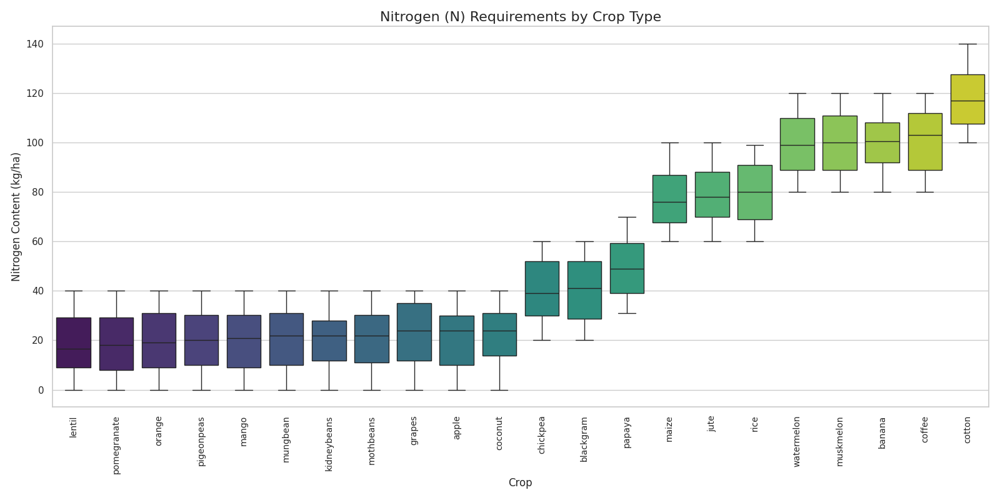

# Agro Smart Recommendation System

**Project Description:** An AI-driven Crop Recommendation System based on soil and climate data.

This project was developed as part of the II IDATA Artificial Intelligence Week (Universidade Federal de Viçosa - UFV). It utilizes Machine Learning algorithms to assist agronomists and farmers in making data-driven decisions about crop selection, aiming to maximize productivity and sustainability.


*(Figure: Nitrogen soil requirements by crop type. The model correctly identifies that legumes require lower soil nitrogen due to biological fixation)*

## Project Objective

The main goal is to solve the crop selection problem by analyzing the complex interaction between soil chemical composition (Nitrogen, Phosphorus, Potassium, pH) and climatic factors (Rainfall, Temperature, Humidity). By using a Random Forest classifier, the system recommends the most suitable crop for a specific set of environmental conditions.

## Key Results and Insights

The Random Forest model achieved an accuracy of **99.3%** on the test dataset. Beyond high precision, the model provided interpretability through Feature Importance analysis, revealing three major agronomic insights:

### 1. Biological Nitrogen Fixation Logic
The model independently learned to distinguish between leguminous plants (such as lentils, kidney beans, and moth beans) and high-yield cash crops (such as cotton and coffee).
* **Observation:** Legumes were clustered in the low-nitrogen requirement category.
* **Agronomic Explanation:** This aligns with biological principles, as legumes perform symbiotic nitrogen fixation and do not depend heavily on nitrogen-rich soil, unlike coffee or cotton.

### 2. Climate as the Primary Limiting Factor
The Feature Importance analysis revealed that **Rainfall** and **Humidity** were the most decisive variables for the model, carrying more weight than soil nutrients.
* **Insight:** This suggests that water availability and climatic zoning are the primary constraints for agricultural suitability in this dataset, prioritizing climate over soil chemistry (which can often be corrected with fertilizers).

### 3. Nutrient Synergy
A strong positive correlation was identified between Phosphorus (P) and Potassium (K) requirements across different crops.
* **Insight:** Crops that demand high levels of Phosphorus tend to also require high levels of Potassium, indicating a consistent physiological need for these macronutrients together.


## Technologies Used

* **Python 3**: Core programming language.
* **Scikit-Learn**: For the Random Forest implementation and model evaluation.
* **Pandas & NumPy**: For data manipulation and analysis.
* **Seaborn & Matplotlib**: For data visualization and generating the insight charts.

## How to Run

1.  Clone this repository:
    ```bash
    git clone [https://github.com/leomoraisf/agro-recommendation-system.git](https://github.com/leomoraisf/agro-recommendation-system.git)
    ```

2.  Install the required dependencies:
    ```bash
    pip install -r requirements.txt
    ```

3.  Run the main script:
    ```bash
    python main.py
    ```

---

**Author:** Leonardo Morais
**Event:** II Semana de Inteligência Artificial do IDATA (UFV)
